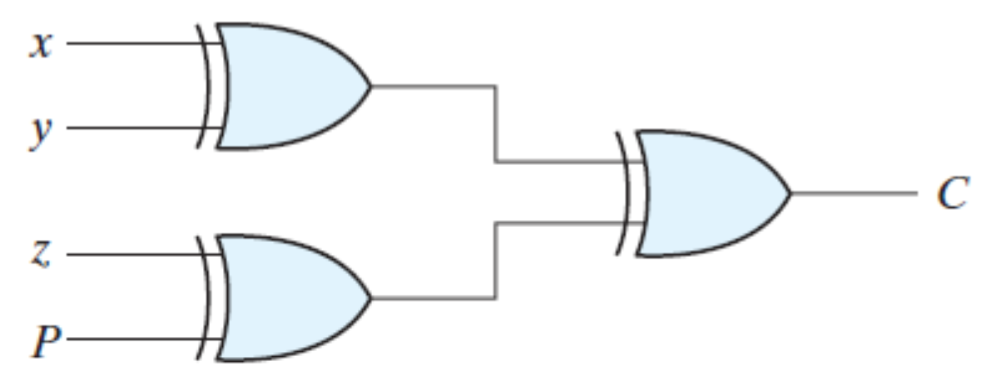
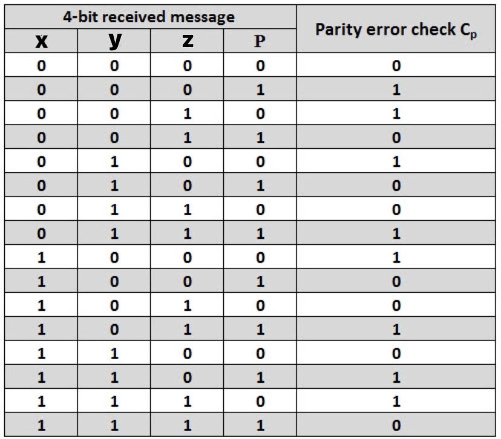

### INTRODUCTION

One of the most widely used error detection techniques for transmission of data for sharing information between devices is <em>**Parity checking**</em>. The Parity Checker matches the number of 1s at the receiver's end with that of the transmitter's end to check for errors. If there is a change in the number of 1s at the receiving end, then that detects the presence of an error. Since the data is transmitted with even parity, there must be an even number of 1s.  

### 4-Bit EVEN Parity Checker

Consider that three input message along with even parity bit is generated at the transmitting end. These 4 bits are applied as input to the parity checker circuit, which checks the possibility of error on the data.  

Fig.1: Logic diagram of a 4-bit even parity checker.

If any error occurs, the received message consists of odd number of 1s. The output of the parity checker is denoted by PEC (Parity Error Check). The below table shows the truth table for the Even Parity Checker in which PEC = 1 if the error occurs, i.e., the four bits received have odd number of 1s and PEC = 0 if no error occurs, i.e., if the 4-bit message has even number of 1s. 
 

Table 1: Truth Table of a 4-bit even parity checker.

The boolean expression for the Parity Error Check, C is as follows: C = x  y  z  P   

### Stuck-at Fault  

The most common model used for logical faults is the single stuck-at fault. Here we assume that some of the circuit lines are permanently fixed at logic-0 or logic-1 due to some failures. This line may be an input or output to any gate. Stuck-at Fault is a Functional Fault on a Boolean (Logic) Function Implementation.  

It is not a physical defect mode. Stuck-at 1 does not mean line is shorted to VDD. Stuck-at 0 does not mean line is grounded. It is an abstract fault model.  A logic stuck-at 1 means when the line is applied a logic 0, it produces a logical error. A logic error means 0 becomes 1 or vice versa.
  

#### Advantages   
<ol>
    <li>Test developed for a single stuck-at fault often finds a large number of other stuck-at faults.</li>
    <li>A series of tests for stuck-at faults will often find a large number of other faults, such as stuck-open faults. This is sometimes called "windfall" fault coverage.</li>
    <li>Parity codes are also commonly used for detecting transmission errors in the external address and data buses.</li>
    <li>As in the case of hardware, the goal of fault detection in software is to determine if a fault has occurred within a system. Single-version fault tolerance techniques usually use various types of acceptance tests to detect faults.</li>
</ol>  

#### Disadvantages
<ol>
    <li>Circuit complexity and the test time to apply an exhaustive list of tests became too time consuming.</li>
    <li>Completely testing by applying all possible inputs and checking that they give the right outputs, is completely impractical: an adder to add two 32-bit numbers would require 264= 1.8*1019 tests, taking 58 years at 0.1 ns/test.</li>
    <li>While the same testing model works moderately well for CMOS, it is not able to detect all possible CMOS faults. This is because CMOS may experience a failure mode known as a stuck-open fault.</li>
</ol>
